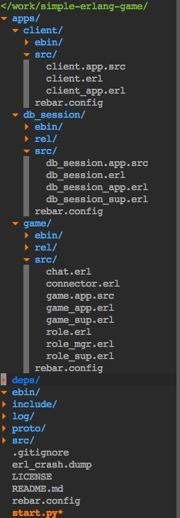

如何编译
==================
##安装emysql
mac下在终端下输入命令
    $ brew install emysql

ubuntu下在终端下输入命令
    $ apt-get install emysql

##安装rebar
mac下终端输入命令
    $ brew install rebar

linux下在[这里](https://github.com/basho/rebar) 下载源码编译或者直接下载rebar二进制文件，之后将rebar拷贝到`/usr/local/bin/`中，就能直接使用rebar命令了

##开始编译
    * cd进simple-erlang-game目录，终端中执行`./start.py rebuild`
    * 第一次编译时需要获取依赖库，编译时会提示缺少几个.erl文件，再运行一次./start.py rebuild就能自动生成缺少的文件了
    * 之后再有代码修改可以直接运行`./start.py build`，这样不用执行`rebar get-deps`和生成`proto`的操作，会比`./start.py rebuild`更快

开启服务器
==================

带终端的服务器
---------------
1. 重置数据库
    执行命令
    $ ./start.py reset_db
    将`src/tools/db_game.sql`注入到mysql中

2. 开启game节点
    执行命令
    $ ./start.py start_game

3. 开启db_session节点:
    新建一个终端并执行命令
    $ ./start.py start_db
    game和db_session节点都启动后会自动连接并且打印log到终端

不带终端的服务器
----------------

1. 开启服务器
    执行命令$ ./start.py start 后game和db_session节点都开启在后台
    * 可以通过命令$ erl -setcookie server -name test@127.0.0.1 -remsh game@127.0.0.1 来连接上`game`节点
    * 运行命令$ erl -setcookie server -name test@127.0.0.1 -remsh db_session@127.0.0.1 来attach上`db_session`节点
    * 通过命令$ ps aux | grep application:ensure_all_started 来查看节点进程信息 

2. 终止服务器:
    执行命令
        $ ./start.py stop 
    来结束`game`和`db_session`节点进程
 

Rebar管理多个app如何配置
==================
使用rebar来管理多个app，使其可以在主目录下编译、清除、打包所有子app，并且所有子app都可以共享一份依赖开源库。

1. 目录结构如下：

2. 需要修改配置的地方：
    (1. 主目录下的rebar.config需要添加sub_dirs字段来标明子app和其rebar.config所在路径，比如这个项目在simple-erlang-game/rebar.config中添加一行：{sub_dirs, ["apps/db", "apps/game", "apps/client"]}.
    (2. 子目录下的rebar.config需要添加deps_dir字段来指定子app依赖的开源库所在目录，这里指定目录为"../../deps"，这样所有的app都会共享一份deps。
    (3. 子目录下的src/rel/reltool.config需要修改lib_dirs字段为{lib_dirs, ["../../../deps"]}，app那一行末尾添加一条属性{lib_dir, ".."}。

